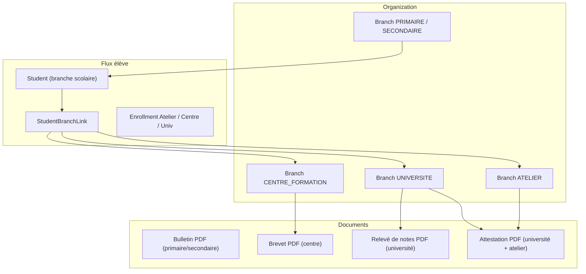

# Plan d'exécution — Module Atelier, Centre de formation & Université

> **Contexte** : Eteyelo gère déjà les branches **PRIMAIRE** et **SECONDAIRE** via `Branch.typebranch` et une couche applicative (`lib/academic-structure.ts`, `lib/class-structure.ts`, `lib/sidebar-menu.ts`, bulletins PDF). Ce document définit l'extension pour trois nouveaux types d'établissement au sein d'une **Organization**.

---

## 1. Synthèse métier

| Type | Code enum proposé | Élèves | Structure académique | Documents fin de cycle |
|------|-------------------|--------|----------------------|------------------------|
| **Atelier** | `ATELIER` | **Récupération uniquement** — l'élève doit déjà exister dans une branche scolaire (primaire/secondaire) de la même organisation | Sessions / groupes pratiques, pas de cursus complet | Aucun brevet — attestation de participation optionnelle |
| **Centre de formation** | `CENTRE_FORMATION` | **Création OU récupération** depuis l'organisation | Programmes → modules → sessions | **Brevet** à la fin de la formation |
| **Université** | `UNIVERSITE` | Création ou récupération (comme centre) | Comme secondaire : **Section → Option → Auditoire** (alias de `Classe`) + Cours + Ponderations | **Relevé de notes** + **Attestations** — **pas de bulletin** |

### Règles transverses confirmées

- Tous les types restent des **Branch** rattachées à une **Organization** (multi-tenant existant).
- Le comportement diverge via `typebranch` + une **matrice de capacités** (pattern déjà utilisé pour primaire vs secondaire).
- Les élèves d'atelier **ne peuvent pas être créés** dans l'atelier : on lie un `Student` existant d'une autre branche de la même org.
- Le centre et l'université peuvent créer un nouvel élève **ou** importer depuis une branche sœur.

---

## 2. État actuel (audit codebase — juillet 2026)

### Ce qui existe et sera réutilisé

| Élément | Fichier / modèle | Réutilisation |
|---------|------------------|---------------|
| Conteneur multi-tenant | `Organization`, `Branch` | Inchangé — ajout de valeurs enum |
| Hiérarchie académique | `Section`, `Option`, `Classe`, `Cours`, `CoursOptionPonderation` | Réutilisé tel quel pour **UNIVERSITE** ; adapté pour **CENTRE_FORMATION** |
| Inscriptions | `ClassEnrollment`, `SchoolYear` | Étendu avec lien source élève |
| Notes | `fiche`, `StudentGrade` | Réutilisé ; pas de bulletin pour université |
| Bulletins PDF | `useBulletinPDF.tsx`, layouts primary/secondary | **Non utilisé** pour université / atelier / centre |
| Menus dynamiques | `lib/sidebar-menu.ts` + `isPrimaryBranch()` | Étendre avec `getBranchCapabilities(typebranch)` |
| Formulaire branche | `create-branch-form.tsx` (shadcn `Select`) | Ajouter les 3 nouveaux types |
| Design system | `DESIGN_SYSTEM.md`, `components/ui/*` | Composants shadcn existants |

### Ce qui n'existe pas encore

- Enum `TypeBrache` limité à `PRIMAIRE | SECONDAIRE` (`prisma/schema.prisma` L1286).
- Lien inter-branches pour un même élève (`Student` est 1:1 avec `BranchMember` d'une seule branche).
- Modèles **Brevet**, **Relevé de notes**, **Attestation** (seule mention légale dans `lib/legal/terms-content.ts`).
- Configuration académique pour université / centre / atelier dans `lib/academic-structure.ts`.

### MCP DBCode

> Le serveur MCP `user-dbcode.dbcode-extension-DBCode` nécessite une authentification. Une fois connecté, utiliser :
> - `dbcode-get-tables` — valider les tables existantes avant migration
> - `dbcode-execute-query` — compter les branches par type, tester les jointures org
> - `dbcode-get-inferred-relationships` — vérifier les FK après ajout de `StudentBranchLink`

---

## 3. Architecture cible



### Principe : matrice de capacités par type

Créer `lib/branch-capabilities.ts` :

```typescript
export type BranchCapability = {
  typebranch: ManagedBranchType;
  label: string;
  studentPolicy: "LINK_ONLY" | "CREATE_OR_LINK";
  usesSectionOption: boolean;
  classLabel: "Classe" | "Auditoire" | "Groupe" | "Session";
  usesBulletin: boolean;
  usesReleve: boolean;
  usesBrevet: boolean;
  usesAttestation: boolean;
  usesPonderation: boolean;
  academicStructureKey: "primary" | "secondary" | "university" | "training" | "workshop";
};
```

Helpers associés : `isAtelierBranch()`, `isCentreFormationBranch()`, `isUniversiteBranch()`, `canCreateStudentInBranch()`, `getClassDisplayLabel()`.

---

## 4. Modèle de données proposé (Prisma)

### 4.1 Extension enum `TypeBrache`

```prisma
enum TypeBrache {
  PRIMAIRE
  SECONDAIRE
  ATELIER
  CENTRE_FORMATION
  UNIVERSITE
}
```

### 4.2 Lien inter-branches — `StudentBranchLink`

Problème actuel : `Student.branchMemberId` est unique → un élève appartient à **une seule** branche.

**Solution recommandée** : table de liaison sans dupliquer l'identité utilisateur.

```prisma
model StudentBranchLink {
  id                String   @id @default(cuid())
  studentId         String   // Student source (branche scolaire ou centre)
  targetBranchId    String   // Atelier, Centre ou Université
  sourceBranchId    String   // Branche d'origine (audit)
  linkType          StudentLinkType @default(IMPORTED)
  isActive          Boolean  @default(true)
  enrolledAt        DateTime @default(now())
  endedAt           DateTime?

  student       Student @relation(fields: [studentId], references: [id], onDelete: Cascade)
  targetBranch  Branch  @relation("TargetBranchLinks", fields: [targetBranchId], references: [id], onDelete: Cascade)
  sourceBranch  Branch  @relation("SourceBranchLinks", fields: [sourceBranchId], references: [id], onDelete: Cascade)

  @@unique([studentId, targetBranchId])
  @@index([targetBranchId])
  @@index([sourceBranchId])
}

enum StudentLinkType {
  IMPORTED    // Récupéré depuis une autre branche
  NATIVE      // Créé directement dans centre/université
}
```

> **Atelier** : `linkType = IMPORTED` obligatoire, `sourceBranchId` requis, validation serveur `canCreateStudentInBranch() === false`.

### 4.3 Programmes de formation (Centre)

```prisma
model TrainingProgram {
  id          String   @id @default(cuid())
  branchId    String
  code        String
  name        String
  durationHours Int?
  description String?
  isActive    Boolean  @default(true)
  modules     TrainingModule[]
  branch      Branch   @relation(fields: [branchId], references: [id], onDelete: Cascade)

  @@unique([branchId, code])
}

model TrainingModule {
  id          String   @id @default(cuid())
  programId   String
  name        String
  order       Int      @default(0)
  isPractical Boolean  @default(true)
  program     TrainingProgram @relation(fields: [programId], references: [id], onDelete: Cascade)
}
```

Alternative MVP : réutiliser `Option` + `Classe` avec un flag `branch.typebranch === CENTRE_FORMATION` et renommer l'UI en « Programme » / « Session ».

### 4.4 Documents officiels

```prisma
model IssuedDocument {
  id            String   @id @default(cuid())
  branchId      String
  studentId     String
  schoolYearId  String?
  documentType  DocumentType
  title         String
  metadata      Json?    // notes, programme, dates, numéro série
  issuedAt      DateTime @default(now())
  issuedById    String?
  pdfUrl        String?  // ou stockage S3/local

  branch   Branch   @relation(fields: [branchId], references: [id], onDelete: Cascade)
  student  Student  @relation(fields: [studentId], references: [id], onDelete: Cascade)

  @@index([branchId, documentType])
  @@index([studentId])
}

enum DocumentType {
  BULLETIN          // existant — généré à la volée, optionnel en DB
  BREVET
  RELEVE_NOTES
  ATTESTATION
  ATTESTATION_PARTICIPATION  // atelier
}
```

---

## 5. Comportement par module

### 5.1 Atelier (`ATELIER`)

| Aspect | Détail |
|--------|--------|
| **Objectif** | Formation pratique courte, complément à la scolarité |
| **Élèves** | Dialog « Importer un élève » — recherche dans toutes les branches scolaires de l'org |
| **Structure** | `SchoolYear` + `Classe` renommée « Groupe atelier » + `Cours` pratiques |
| **Notes** | Optionnelles (compétences / présence) — pas de bulletin |
| **Calendrier** | Sessions datées, lien avec `AttendanceSession` existant |
| **Document** | Attestation de participation (PDF simple) |
| **Menu masqué** | Sections, Options, Ponderations, Fiches/Bulletins, Finance (si non applicable) |

**Validation serveur clé** :
```typescript
if (branch.typebranch === "ATELIER" && action === "CREATE_STUDENT") {
  throw new Error("Les élèves d'atelier doivent être importés depuis une branche scolaire.");
}
```

### 5.2 Centre de formation (`CENTRE_FORMATION`)

| Aspect | Détail |
|--------|--------|
| **Objectif** | Formation professionnelle certifiante |
| **Élèves** | Onglets « Nouvel apprenant » \| « Importer depuis l'organisation » |
| **Structure** | Programme (`TrainingProgram` ou `Option`) → Session (`Classe`) → Modules (`Cours`) |
| **Notes** | Fiches de cotes par module ; seuil de réussite configurable |
| **Document** | **Brevet** PDF avec numéro, programme, date, signature |
| **Calendrier académique** | Structure dédiée `TRAINING_ACADEMIC_STRUCTURE` (ex. modules + examen final) |
| **Finance** | Frais par programme — réutiliser `Frais` + `TypeFrais` |

### 5.3 Université (`UNIVERSITE`)

| Aspect | Détail |
|--------|--------|
| **Objectif** | Enseignement supérieur (LMD ou équivalent RDC) |
| **Élèves** | Création ou import (comme centre) |
| **Structure** | Identique secondaire : Section → Option → **Auditoire** (UI label pour `Classe`) |
| **Cours / Ponderations** | Réutiliser `CoursOptionPonderation` |
| **Périodes** | Réutiliser structure **secondaire** (2 semestres) ou variante universitaire configurable |
| **Notes** | `fiche` + `StudentGrade` — mêmes écrans que secondaire |
| **Documents** | **Relevé de notes** (transcript semestriel/annuel) + **Attestations** (inscription, réussite UE) |
| **Pas de bulletin** | Masquer menu « Fiches » bulletin ; remplacer par « Relevés » et « Attestations » |
| **Menu masqué** | Bulletin primaire/secondaire, domaines primaires |

---

## 6. UI / shadcn — composants à créer

Tous basés sur le design system existant (`components/ui/*`, `DESIGN_SYSTEM.md`).

| Composant | Emplacement proposé | shadcn / custom |
|-----------|---------------------|-----------------|
| `BranchTypeSelect` | `components/branch/branch-type-select.tsx` | `Select`, `Form`, badges par type |
| `ImportStudentDialog` | `.../student/components/import-student-dialog.tsx` | `Dialog`, `Command` (recherche), `DataTable` |
| `StudentSourceBadge` | `components/student/student-source-badge.tsx` | `Badge` — « Importé · École X » / « Créé ici » |
| `AuditoireLabel` | helper i18n/label | mapping `getClassDisplayLabel(typebranch)` |
| `IssueBrevetDialog` | centre — `.../documents/issue-brevet-dialog.tsx` | `Dialog`, `Form`, preview PDF |
| `ReleveNotesClient` | université — `.../releves/page.tsx` | `Tabs`, `Card`, export PDF |
| `AttestationList` | université + atelier | `DataTable`, `DropdownMenu` actions |
| `TrainingProgramForm` | centre | `Form`, `Input`, `Textarea`, `Switch` |
| `BranchCapabilityGuard` | HOC / wrapper | masque routes selon `getBranchCapabilities()` |

### Écran création de branche (extension)

Fichier : `create-branch-form.tsx`

Ajouter dans le `Select` :
- Atelier — formation pratique
- Centre de formation — certifiant (brevet)
- Université — enseignement supérieur

Afficher une **Alert** (shadcn) descriptive selon le type sélectionné.

### Sidebar dynamique

Étendre `lib/sidebar-menu.ts` :

```typescript
function filterMenuByBranchType(item: StaticMenuItem, typebranch: unknown): StaticMenuItem | null {
  const caps = getBranchCapabilities(typebranch);
  if (item.href.includes("/section") && !caps.usesSectionOption) return null;
  if (item.href.includes("/fiches") && !caps.usesBulletin) return null;
  // ...
}
```

Ajouter entrées conditionnelles :
- Centre : « Programmes », « Brevets »
- Université : « Relevés de notes », « Attestations »
- Atelier : « Groupes », « Import élèves »

---

## 7. Phases d'exécution

### Phase 0 — Cadrage & validation (3–5 jours)

- [ ] Valider avec le métier les libellés RDC (brevet vs certificat, structure LMD)
- [ ] Confirmer si un élève peut être dans **plusieurs ateliers** simultanément (oui recommandé)
- [ ] Confirmer périmètre finance pour atelier/centre
- [ ] Connecter MCP DBCode et exporter l'inventaire des branches existantes
- [ ] Rédiger les maquettes Figma ou wireframes des 3 flux élèves

**Livrable** : fiche métier signée + schéma DB validé.

---

### Phase 1 — Fondations techniques (1 semaine)

**Objectif** : infrastructure commune sans UI métier complète.

1. **Prisma**
   - Étendre `TypeBrache`
   - Créer `StudentBranchLink`, `IssuedDocument`, enums associés
   - Migration + seed de test (1 org, 1 branche de chaque type)
   - Index `@@index([organizationId, typebranch])` sur `Branch`

2. **Lib partagées**
   - `lib/branch-capabilities.ts`
   - `lib/academic-structure.ts` → ajouter `UNIVERSITY_ACADEMIC_STRUCTURE`, `TRAINING_ACADEMIC_STRUCTURE`, `WORKSHOP_ACADEMIC_STRUCTURE`
   - `lib/class-structure.ts` → règles auditoire / groupe
   - `lib/document-types.ts`

3. **Types & validation Zod**
   - `branchTypeSchema` : 5 valeurs
   - `importStudentSchema`, `issueDocumentSchema`

4. **Tests unitaires**
   - `normalizeBranchType()`, `canCreateStudentInBranch()`, filtrage menu

**Fichiers touchés** :
- `prisma/schema.prisma`
- `lib/academic-structure.ts`, `lib/class-structure.ts`
- `app/admin/.../branches/(no-layout)/schema.ts`

---

### Phase 2 — Création de branche & navigation (3–4 jours)

1. Formulaire création branche — 5 types + descriptions
2. `branche.action.ts` — bootstrap par type :
   - Atelier : périodes simplifiées (session unique ou trimestre)
   - Centre : structure training par défaut
   - Université : import catalogue secondaire adapté (`lib/university-catalog-sync.ts`)
3. Sidebar + branch picker — icônes / badges par type
4. Guards de routes — redirect si fonctionnalité non disponible pour le type

**Livrable** : créer une branche de chaque nouveau type depuis l'admin.

---

### Phase 3 — Module Atelier (1–1,5 semaine)

1. **Import élève**
   - Action `searchOrganizationStudentsAction(orgId, query)` — toutes branches scolaires
   - Action `linkStudentToAtelierAction(studentId, atelierBranchId)`
   - UI : `ImportStudentDialog` avec recherche Command

2. **Groupes & sessions**
   - CRUD Classe (label « Groupe ») — réutiliser pages existantes avec label dynamique
   - Inscription via `ClassEnrollment` + enregistrement `StudentBranchLink`

3. **Présence & pratique**
   - Réutiliser `attendance` existant
   - Fiches simplifiées (optionnel) — type `fichePratique`

4. **Attestation participation**
   - `useAttestationPDF.tsx` (jsPDF, pattern bulletin)
   - Enregistrement `IssuedDocument` type `ATTESTATION_PARTICIPATION`

5. **Blocage création directe**
   - Désactiver bouton « Nouvel élève » + message explicite

**Routes** :
```
/admin/organizations/[orgId]/branches/[branchId]/student/import
/admin/organizations/[orgId]/branches/[branchId]/attestations
```

---

### Phase 4 — Module Centre de formation (1,5–2 semaines)

1. **Apprenants** — dual mode create / import (comme université)
2. **Programmes** — CRUD `TrainingProgram` + modules (ou réutilisation Option/Cours)
3. **Sessions & inscriptions** — `ClassEnrollment` lié au programme
4. **Évaluation** — fiches par module, calcul réussite
5. **Brevet**
   - Template PDF `brevet-layout.ts`
   - Workflow : clôture formation → éligibilité → émission brevet → `IssuedDocument`
   - Numérotation : `{branchCode}-{year}-{sequence}`

6. **Finance programme** — lier `Frais` au programme

**Routes** :
```
.../programmes
.../programmes/[programId]
.../brevets
.../brevets/[documentId]
```

---

### Phase 5 — Module Université (2–2,5 semaines)

#### Calendrier LMD (ESU / RDC)

L'année académique (`SchoolYear`) est découpée en **deux semestres** par année. La numérotation globale LMD dépend du niveau de l'auditoire :

| Niveau | Semestres globaux |
|--------|-------------------|
| Licence 1 (L1) | S1, S2 |
| Licence 2 (L2) | S3, S4 |
| Licence 3 (L3) | S5, S6 |
| Master 1 (M1) | S7, S8 |
| Master 2 (M2) | S9, S10 |
| Doctorat | S11 à S16 |

Structure par année académique (implémentée dans `lib/academic-structure.ts` + `lib/university-lmd.ts`) :

```
Année académique
├── Premier semestre
│   ├── Cours
│   ├── Évaluations
│   ├── Première session (examens ordinaires)
│   └── Délibérations
└── Deuxième semestre
    ├── Cours
    ├── Évaluations
    ├── Première session (examens ordinaires)
    ├── Deuxième session (rattrapage, si organisée)
    ├── Défense de TFC ou de mémoire (pour les finalistes)
    └── Délibérations
```

Libellés centralisés dans `lib/university-lmd-labels.ts`. Helpers : `formatGlobalSemesterCode("L3", 1)` → `S5`, `formatUniversitySemesterLabel(1, "L3")` → `Premier semestre (S5)`, `getUniversityLmdCalendarOutline()` pour l'arborescence.

1. **Structure académique**
   - Sections, Options, Auditoires — réutiliser pages secondaire
   - Label UI via `getClassDisplayLabel("UNIVERSITE")` → « Auditoire »
   - Sync catalogue : `lib/university-catalog-sync.ts` (facultés, filières)

2. **Cours & ponderations** — identique secondaire

3. **Notes & relevés**
   - Réutiliser saisie `fiche` / `notes`
   - **Ne pas** brancher sur `useBulletinPDF`
   - Nouveau `useReleveNotesPDF.tsx` :
     - Colonnes par UE/cours, crédits, moyenne semestre
     - Pas de décision du conseil (bulletin secondaire)

4. **Attestations**
   - Types : inscription, assiduité, réussite semestre
   - Template PDF + historique `IssuedDocument`

5. **Résultats** — page résultats adaptée (pas bulletin, mais relevé)

**Routes** :
```
.../section, .../option, .../classe  (labels auditoire)
.../releves
.../releves/[studentId]
.../attestations
```

---

### Phase 6 — Documents PDF & impression (1 semaine)

| Document | Layout file | Basé sur |
|----------|-------------|----------|
| Brevet | `brevet-layout.ts` | `bulletin-secondary-layout.ts` |
| Relevé notes | `releve-notes-layout.ts` | agrégation `fiche` + crédits |
| Attestation | `attestation-layout.ts` | template minimal |

- Prévisualisation shadcn `Dialog` + bouton Imprimer
- Stockage optionnel PDF (`IssuedDocument.pdfUrl`)
- Numérotation et anti-doublon

---

### Phase 7 — Permissions, tests & migration prod (1 semaine)

1. **Permissions** — vérifier rôles org/branch pour émission documents
2. **Migration données** — aucune branche existante affectée (nouveaux enum values)
3. **Tests E2E** :
   - Atelier : import → inscription groupe → attestation
   - Centre : création apprenant → brevet
   - Université : auditoire → notes → relevé
4. **Script** : `scripts/test-branch-type-isolation.ts` (étendre bulletin isolation)
5. **Documentation utilisateur** — aide contextuelle par type

---

## 8. Ordre de priorité recommandé

```
Phase 0 → Phase 1 → Phase 2 → Phase 3 (Atelier)
                              → Phase 4 (Centre)
                              → Phase 5 (Université)
                              → Phase 6 (PDF)
                              → Phase 7 (Prod)
```

**MVP rapide (4 semaines)** : Phases 0–2 + Atelier complet + Centre (sans finance) + Université (structure + relevé basique).

---

## 9. Risques & mitigations

| Risque | Impact | Mitigation |
|--------|--------|------------|
| `Student` lié à un seul `BranchMember` | Bloque import atelier | `StudentBranchLink` + enrollment via lien |
| Explosion de complexité menus | UX confuse | Matrice `branch-capabilities` centralisée |
| Duplication logique PDF | Maintenance | Moteur PDF commun `lib/pdf-engine.ts` |
| Règles académiques université floues | Retravail | Phase 0 cadrage LMD + config JSON |
| Performance recherche inter-branches | Lent sur grosses orgs | Index + pagination + cache org students |

---

## 10. Checklist MCP DBCode (post-auth)

```sql
-- Inventaire types de branches
SELECT typebranch, COUNT(*) FROM "Branch" GROUP BY typebranch;

-- Élèves par organisation (pour tester import atelier)
SELECT b."organizationId", COUNT(DISTINCT s.id)
FROM "Student" s
JOIN "BranchMember" bm ON s."branchMemberId" = bm.id
JOIN "Branch" b ON bm."branchId" = b.id
GROUP BY b."organizationId";

-- Après migration : liens inter-branches
SELECT * FROM "StudentBranchLink" LIMIT 20;
```

---

## 11. Fichiers clés à créer / modifier

### Nouveaux fichiers

```
context/module-univ-centre-atelier.md          (ce document)
lib/branch-capabilities.ts
lib/university-catalog-sync.ts
lib/training-catalog-sync.ts
lib/pdf/brevet-layout.ts
lib/pdf/releve-notes-layout.ts
lib/pdf/attestation-layout.ts
app/admin/.../student/components/import-student-dialog.tsx
app/admin/.../brevets/
app/admin/.../releves/
app/admin/.../attestations/
prisma/migrations/YYYYMMDD_branch_types_atelier_centre_univ/
```

### Fichiers existants à modifier

```
prisma/schema.prisma
lib/academic-structure.ts
lib/class-structure.ts
lib/sidebar-menu.ts
app/admin/.../new/components/create-branch-form.tsx
app/admin/.../schema.ts
app/admin/.../branche.action.ts
app/admin/.../student/student.action.ts
app/admin/.../student/page.tsx
```

---

## 12. Critères d'acceptation globaux

- [ ] Une organisation peut avoir simultanément primaire, secondaire, atelier(s), centre(s), université(s)
- [ ] Atelier : impossible de créer un élève — import uniquement depuis branche scolaire de la même org
- [ ] Centre : création ou import ; brevet PDF émis et tracé en base
- [ ] Université : section/option/auditoire/cours fonctionnels ; relevé et attestation PDF ; pas de bulletin
- [ ] Menus et libellés UI cohérents par type (shadcn)
- [ ] Aucune régression primaire/secondaire (tests isolation)
- [ ] MCP DBCode utilisé pour valider migrations et requêtes inter-branches

---

*Document généré le 17 juillet 2026 — à mettre à jour après Phase 0 (cadrage métier).*
