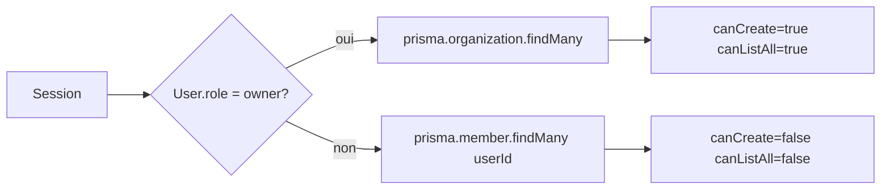

# Flux des roles organisations et permissions

Documentation de reference pour le modele Better Auth (plugins `admin` + `organization`) dans Eteyelo.

## Roles applicatifs (`User.role`)

| Role | Slug | Portee |
|------|------|--------|
| Proprietaire plateforme | `owner` | Toutes les organisations |
| Gestionnaire organisation | `admin` | Son organisation (CRU) |
| Utilisateur | `user` | Branche ou module selon membership |
| Support plateforme | `platform_support` | Support Klambocore |

## Roles organisation (`Member.role`)

| Role | Slug | Portee |
|------|------|--------|
| Proprietaire org | `owner` | CRUD organisation |
| Gestionnaire org | `gestionnaire` | Gestion complete sans delete org |
| Enseignant | `teacher` | Branche |
| Parent | `parent` | Branche |
| Eleve | `student` | Branche |
| Ecodim | `responsable`, `moniteur`, `surveillant` | Module ecodim |

## Routage post-login

```mermaid
flowchart TD
    A[Connexion] --> B{User.role?}
    B -->|owner| C[/admin]
    B -->|admin| D[/admin/organizations/orgId]
    B -->|platform_support| F[/admin/platform-support]
    B -->|user| E{Contexte membre}
    E -->|teacher/parent/student + branche| G[/admin/organizations/orgId/branches/branchId]
    E -->|multi-branches| P[/admin/organizations/orgId/branch-picker]
    E -->|responsable/moniteur/surveillant| H[/admin/organizations/orgId/ecodim]
    E -->|owner/gestionnaire membre| D
```

## Liste organisations (`GET /api/organizations`)



Ne pas utiliser `authClient.useListOrganizations()` pour le owner plateforme.

## Verification permissions serveur

### Option A — helpers projet

```typescript
import { canAccessOrganization } from "@/lib/auth/organization-access";
import { guardOrganizationMemberPermission } from "@/lib/auth/has-organization-permission";
```

### Option B — Better Auth natif

```typescript
const { success } = await auth.api.hasPermission({
  headers: await headers(),
  body: {
    permissions: { member: ["create"] },
    organizationId,
  },
});
```

Le owner plateforme sans membership doit etre bypass manuellement cote serveur.

## Session enrichie (`customSession`)

- `user.role` — role applicatif
- `organization.role` — role membre dans l'org active
- `organization.id` — organisation active
- `branch` — branche active
- `session.activeBranchId` — branche persistee

## Fichiers de reference

| Domaine | Fichier |
|---------|---------|
| Matrices AC | `lib/permissions.ts` |
| Acces org | `lib/auth/organization-access.ts` |
| Guards pages | `lib/auth/require-organization-permission.ts` |
| Permissions membres | `lib/auth/has-organization-permission.ts` |
| Routage post-login | `lib/auth/post-login-routing.ts` |
| Migration donnees | `lib/auth/migrate-organization-roles.ts` |
| Comptes demo | `prisma/seeds/demoAccounts.ts` |

## Tests automatises

```bash
pnpm test:organizations
```

Couvre permissions, guards, matrices AC et routage post-login.

## Phases implementees

1. [Phase 01 - Fondations](./phase-01-organisations-permissions.md)
2. [Phase 02 - Garde-fous](./phase-02-organisations-garde-fous.md)
3. [Phase 03 - UI CRUD](./phase-03-organisations-crud-ui.md)
4. [Phase 04 - Permissions membres](./phase-04-organisations-permissions-membres.md)
5. [Phase 05 - Navigation](./phase-05-organisations-navigation.md)
6. [Phase 06 - Seeds](./phase-06-organisations-seeds.md)
7. [Phase 07 - Migration](./phase-07-organisations-migration-donnees.md)
8. [Phase 08 - Tests](./phase-08-organisations-tests.md)
