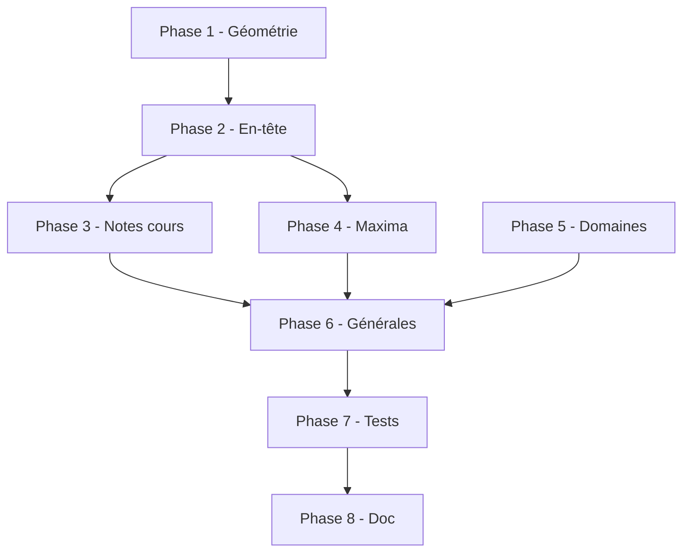

# Plan d'exécution — Bulletin primaire v2 (modèle RDC)

**Date :** 14 juillet 2026  
**Statut :** ✅ Exécuté (14 juillet 2026)  
**Dossier spec :** `context/primaireUnit/`

---

## Objectif

Refondre le bulletin primaire pour correspondre au modèle officiel RDC :

1. Nouvel en-tête : `MAX Per | périodes | MAX EX | PTS OBT | MAX TRIM | PTS OBT` par trimestre.
2. Colonne finale `MAX | PTS OBT` à la place de `TG` (sans titre parent).
3. Cours regroupés par **5 domaines** avec lignes MAXIMA par domaine et MAXIMA GÉNÉRAL.
4. Première colonne renommée `BRANCHES`.

---

## Ordre d'exécution

Les phases sont **séquentielles** : ne pas sauter une phase sans valider la précédente.

---

### Phase 1 — Fondations layout (géométrie)

**But :** Remplacer la structure `TR JOURN | EXAM | TOT` par la grille plate 21 cellules.

| # | Tâche | Fichier |
| --- | --- | --- |
| 1.1 | Porter `structure-colonnes.ts` → `bulletin-primary-layout.ts` | `bulletin-primary-layout.ts` |
| 1.2 | Nouveau type `PrimaryTrimesterSubLayoutV2` avec positions X par cellule | idem |
| 1.3 | `buildPrimaryBulletinLayout()` : 5 col. principales, ratios v2 | idem |
| 1.4 | `getPrimaryEvaluationCellWidths()` → 21 largeurs | idem |
| 1.5 | Renommer `PRIMARY_TG_COL_INDEX` → `PRIMARY_FINAL_COL_INDEX` | idem |
| 1.6 | Mettre à jour `scripts/test-bulletin-layouts.ts` | tests |

**Critère de validation :**
- 5 colonnes principales, 21 cellules d'évaluation.
- Positions X dérivées des ratios, pas de coordonnées fixes.
- Tests layout passent.

**Estimation :** 2–3 h

---

### Phase 2 — En-tête tableau (textes et fusion)

**But :** Dessiner l'en-tête 3 niveaux conforme au modèle photo.

| # | Tâche | Fichier |
| --- | --- | --- |
| 2.1 | `BRANCHES` au lieu de `COURS` | `bulletin-primary-layout.ts` |
| 2.2 | Refondre `drawTrimesterHeader()` → colonnes plates niveau 2 | idem |
| 2.3 | Trimestre 1 : 7 sous-libellés dont `MAX Per` | idem |
| 2.4 | Trimestres 2–3 : 6 sous-libellés (sans MAX Per) | idem |
| 2.5 | Colonne finale : `MAX \| PTS OBT` directement qui regroupe `MAX \| PTS OBT`  ( « TOTAL »)
| 2.6 | PDF visuel : vérifier alignement horizontal | `test-bulletin-visual-primary.ts` |

**Critère de validation :**
- En-tête visuellement aligné avec la photo fournie.
- Libellés : `MAX Per`, `1erP`, `2eP`, `MAX EX`, `PTS OBT`, `MAX TRIM`, etc.

**Estimation :** 2–3 h

---

### Phase 3 — Rendu lignes cours (notes)

**But :** Afficher les notes dans la nouvelle grille.

| # | Tâche | Fichier |
| --- | --- | --- |
| 3.1 | Refondre `drawPrimaryMatiere()` : boucle sur `PRIMARY_EVAL_COLUMNS` | `bulletin-primary-render.ts` |
| 3.2 | Séparer examen en `MAX EX` (vide) + `PTS OBT` (note) | idem |
| 3.3 | Séparer total trimestre en `MAX TRIM` (vide) + `PTS OBT` (total) | idem |
| 3.4 | Colonne finale : `MAX` (vide) + `PTS OBT` (somme annuelle) | idem |
| 3.5 | Cellule `MAX Per` vide sur lignes cours | idem |
| 3.6 | Conserver `getColor()` et `activePeriodKeys` | idem |

**Critère de validation :**
- Notes aux bons emplacements sur PDF test.
- Totaux trimestre et annuel corrects.

**Estimation :** 3–4 h

---

### Phase 4 — Lignes MAXIMA (domaine + général)

**But :** Afficher les maxima dans les colonnes `MAX Per`, `MAX EX`, `MAX TRIM`, `MAX` (colonne finale).

| # | Tâche | Fichier |
| --- | --- | --- |
| 4.1 | `computeTrimesterMaxima()` et `computeYearMaxima()` | `lib/bulletin-maxima.ts` |
| 4.2 | Refondre `drawPrimaryTrimesterMaximaRow()` pour 21 cellules | `bulletin-primary-layout.ts` |
| 4.3 | Créer `drawPrimaryDomainMaximaRow()` | `bulletin-primary-render.ts` |
| 4.4 | Créer `drawPrimaryGeneralMaximaRow()` | `bulletin-primary-render.ts` |
| 4.5 | Ligne maxima : maxima dans colonnes max, vide dans PTS OBT | idem |

**Critère de validation :**
- Ligne maxima affiche barèmes alignés sous les bons en-têtes.
- MAXIMA GÉNÉRAL = somme des domaines.

**Estimation :** 2–3 h

---

### Phase 5 — Regroupement par domaine (données)

**But :** Remplacer le regroupement par signature maxima par les 5 domaines.

| # | Tâche | Fichier |
| --- | --- | --- |
| 5.1 | Créer `lib/primary-domains.ts` (enum + mapping fallback) | nouveau |
| 5.2 | *(Optionnel)* Migration Prisma `primaryDomain` sur `Cours` | `schema.prisma` |
| 5.3 | `buildPrimaryDomainBlocs()` dans `useBulletinPDF.tsx` | `useBulletinPDF.tsx` |
| 5.4 | UI admin : sélecteur domaine dans formulaire cours | `cours-form.tsx` |
| 5.5 | Ordre des cours par `domainOrder` | idem |

**Critère de validation :**
- Cours groupés sous les 5 domaines dans l'ordre défini.
- Cours non mappés → domaine `DEVELOPPEMENT` ou section « Non classé ».

**Estimation :** 4–6 h (sans migration Prisma : 2–3 h)

---

### Phase 6 — Lignes générales et titres domaine

**But :** Adapter TOTAUX, POURCENTAGES, etc. et ajouter les en-têtes de domaine.

| # | Tâche | Fichier |
| --- | --- | --- |
| 6.1 | `drawPrimaryDomainHeader()` | `bulletin-primary-render.ts` |
| 6.2 | Refondre `drawPrimarySubjectRow()` pour 21 cellules | idem |
| 6.3 | TOTAUX / POURCENTAGES : MAX TRIM + PTS OBT + MAX \| PTS OBT | idem |
| 6.4 | SIGNATURE PARENTS : grille vide 21 col. | idem |
| 6.5 | APPLICATIONS / CONDUITE : fond noir sur colonnes exam/total | idem |

**Critère de validation :**
- Bloc GENERAUX complet et lisible.
- Titres domaine visibles avant chaque groupe de cours.

**Estimation :** 3–4 h

---

### Phase 7 — Tests et validation visuelle

| # | Tâche | Fichier |
| --- | --- | --- |
| 7.1 | Mettre à jour `test-bulletin-layouts.ts` | scripts |
| 7.2 | Mettre à jour `test-bulletin-calculations.ts` | scripts |
| 7.3 | Générer PDFs dans `context/samples/primaireUnit-v2/` | scripts |
| 7.4 | Test avec données réelles (fiche existante) | manuel |
| 7.5 | Vérifier non-régression secondaire | `test-bulletin-isolation.ts` |

**Critère de validation :**
- Tous les scripts tests passent.
- PDF primaire conforme à la photo.
- Bulletin secondaire inchangé.

**Estimation :** 2 h

---

### Phase 8 — Documentation et nettoyage

| # | Tâche |
| --- | --- |
| 8.1 | Mettre à jour `context/bulletins-primaire-secondaire.md` |
| 8.2 | Marquer `plan-execution-bulletin-layouts-v2.md` comme supersédé |
| 8.3 | Supprimer constantes obsolètes (`PRIMARY_TRIM_SUB_RATIOS`, etc.) |
| 8.4 | Rapport final dans `context/primaireUnit/rapport-validation.md` |

**Estimation :** 1 h

---

## Récapitulatif

| Phase | Description | Durée estimée |
| --- | --- | --- |
| **1** | Géométrie layout 21 cellules | 2–3 h |
| **2** | En-tête tableau (textes) | 2–3 h |
| **3** | Rendu notes cours | 3–4 h |
| **4** | Lignes MAXIMA | 2–3 h |
| **5** | Domaines (données) | 2–6 h |
| **6** | Générales + titres domaine | 3–4 h |
| **7** | Tests | 2 h |
| **8** | Documentation | 1 h |
| **Total** | | **17–26 h** |

---

## Diagramme de dépendances



> Phase 5 peut démarrer en parallèle de Phase 3–4 (données indépendantes du rendu).

---

## Prochaine action

**Démarrer Phase 1** : porter `context/primaireUnit/structure-colonnes.ts` vers `bulletin-primary-layout.ts`.

Commande de validation après Phase 1 :

```bash
pnpm tsx scripts/test-bulletin-layouts.ts
```
