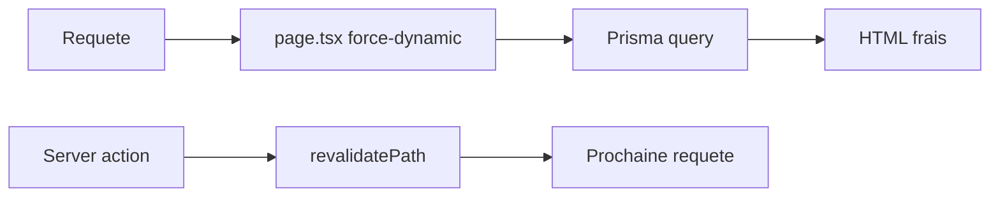

# Matrice des rôles d’organisation

**Statut :** Phases 1–3 terminées — doc + permissions + labels/routing/UI alignés  
**Source de vérité code :** [`lib/permissions.ts`](../lib/permissions.ts)  
**Plan d’exécution :** [`plan-execution-roles-organisation.md`](./plan-execution-roles-organisation.md)

Décisions figées :

- **1A** — mêmes actions CRUD sur **toutes** les ressources métier d’organisation
- **2A** — migration des anciens slugs (`surveillant` → `superviseur`, `responsable` → `directeur`, `moniteur` → `prefet`)

---

## Slugs et labels

| Slug | Label |
|------|-------|
| `owner` | Propriétaire |
| `gestionnaire` | Gestionnaire |
| `prefet` | Préfet |
| `directeur` | Directeur |
| `teacher` | Enseignant |
| `superviseur` | Superviseur |
| `caissier` | Caissier |
| `student` | Élève |
| `parent` | Parent |
| `support` | Support établissement |

Slugs **retirés** : `moniteur`, `responsable`, `surveillant`.  
Slugs **ajoutés** : `prefet`, `directeur`, `superviseur`, `caissier`.

---

## Matrice rôles × actions (décision 1A)

Même jeu d’actions sur **toutes** les ressources métier : `member`, `branch`, `teacher`, `parent`, `personnel`, `schedule`, `inscription`, plus les ressources Better Auth utiles (`organization`, `invitation`, `team`, `ac`) au même niveau **quand applicable**.

| Slug | Label | create | read | update | delete |
|------|-------|:------:|:----:|:------:|:------:|
| `owner` | Propriétaire | Oui | Oui | Oui | Oui |
| `gestionnaire` | Gestionnaire | Oui | Oui | Oui | Non* |
| `prefet` | Préfet | Oui | Oui | Oui | Non* |
| `directeur` | Directeur | Oui | Oui | Oui | Non* |
| `teacher` | Enseignant | Oui | Oui | Non | Non |
| `superviseur` | Superviseur | Oui | Oui | Oui | Oui |
| `caissier` | Caissier | Oui | Oui | Oui | Non |
| `student` | Élève | Non | Oui | Non | Non |
| `parent` | Parent | Non | Oui | Non | Non |
| `support` | Support établissement | — | — | — | — |

\* Aucun rôle org n’a `organization: ["delete"]` : la suppression physique est réservée au **owner plateforme** (`APP_ROLE.OWNER`). Le **propriétaire org** (`ORG_ROLE.OWNER`) peut **archiver** (via `organization: ["update"]`) mais pas supprimer. Les actions métier hors `organization` suivent la colonne delete du tableau pour `superviseur` / `owner` uniquement.

### Synthèse actions (liste)

| Slug | Actions (ressources métier) |
|------|-----------------------------|
| `owner` | create, read, update, delete |
| `gestionnaire` | create, read, update |
| `prefet` | create, read, update |
| `directeur` | create, read, update |
| `teacher` | create, read |
| `superviseur` | create, read, update, delete |
| `caissier` | create, read, update |
| `student` | read |
| `parent` | read |
| `support` | **inchangé** (voir ci-dessous) |

### Règles propriétaire / managers

- CRUD métier **dans son organisation** (scopé Better Auth par `organizationId` / membership).
- Base `ownerAc` + ressources métier en CRUD explicite, **sauf** `organization: ["delete"]` retiré pour le propriétaire org.
- Suppression physique d’organisation : **owner plateforme uniquement**.
- Archivage d’organisation : propriétaire org + owner plateforme.
- `gestionnaire` / `prefet` / `directeur` : **pas** de `organization: ["delete"]`.
- Helper recommandé dans `lib/permissions.ts` :

```ts
function withActions(actions: readonly ("create"|"read"|"update"|"delete")[]): StatementShape
```

pour éviter de dupliquer la grille sur chaque ressource.

---

## Support inchangé

Le rôle `support` conserve sa grille historique :

- lecture `member` / `branch`
- lecture `organizationSupport`
- création / lecture `platformEscalation`

Pas de CRUD métier élargi (pas d’application de la matrice 1A).

---

## Migration des slugs (décision 2A)

| Ancien | Nouveau |
|--------|---------|
| `surveillant` | `superviseur` |
| `responsable` | `directeur` |
| `moniteur` | `prefet` |

`Member.role` peut être CSV → utiliser `REPLACE` (ou équivalent script) :

```sql
UPDATE "member" SET role = REPLACE(role, 'surveillant', 'superviseur');
UPDATE "member" SET role = REPLACE(role, 'responsable', 'directeur');
UPDATE "member" SET role = REPLACE(role, 'moniteur', 'prefet');
```

Puis nettoyer / resync `OrganizationRole` (dynamic AC) pour les slugs obsolètes et upsert les nouveaux presets si le bootstrap le fait déjà.

Script / SQL de référence :

- `lib/auth/migrate-organization-roles.ts`
- `scripts/migrate-organization-roles.ts`
- `prisma/scripts/migrate-organization-roles.sql`
- commande typique : `pnpm run migrate:org-roles` (dry-run / audit selon implémentation)

---

## Fichiers touchés (rôles)

| Zone | Fichiers |
|------|----------|
| AC | `lib/permissions.ts` |
| Labels | `lib/org-role-labels.ts` |
| Sidebar / nav | `lib/sidebar-menu.ts`, `components/layout/mobile-nav.tsx` |
| Routing | `lib/auth/post-login-routing.ts`, `lib/auth/resolve-user-organization-path.ts` |
| Session / garde | `lib/auth/session-roles.ts`, `lib/auth/enforce-admin-route-access.ts` |
| Migration | `lib/auth/migrate-organization-roles.ts`, `prisma/scripts/migrate-organization-roles.sql` |
| Forms | membres / personnel (via `ALL_ORG_ROLE_SLUGS` / `ORGANIZATION_ROLE_SLUGS`) |
| Tests | `scripts/test-organizations-permissions.ts`, `scripts/test-post-login-routing.ts` |
| Seeds | seeds / scripts avec anciens slugs hardcodés |

Managers routes admin : `owner` + `gestionnaire` (+ éventuellement `directeur` / `prefet` si accès large UI org).

---

## Pattern `force-dynamic` (pages Prisma)

Sur les pages `app/**/page.tsx` qui lisent Prisma au rendu serveur :

```ts
export const dynamic = "force-dynamic";
```

| Règle | Détail |
|-------|--------|
| Effet | Pas de cache de page / prerender figé ; données fraîches à chaque requête |
| Alternative (Next 15) | `import { connection } from "next/server"; await connection();` en tête de page |
| Après mutations | Garder `revalidatePath(...)` dans les server actions |
| Interdit | `force-static` sur ces pages |
| Périmètre | **Pas** de `force-dynamic` global sur tout `/admin` : page par page |

Exemples déjà en place (partiel) : `app/page.tsx`, `app/depot-candidature/page.tsx`, `app/resultats/page.tsx`, `app/components/inscription-eleve/page.tsx`, miroirs `app/components/etablissements/**`. Le reste de la liste ci-dessous est à couvrir en Phase 5.

### Pages publiques prioritaires (force-dynamic)

Fichiers `page.tsx` confirmés (liste figée Phase 1 — implémentation Phase 5) :

| Zone | Route réelle (`app/`) | Miroir / pages liées |
|------|----------------------|----------------------|
| Inscription élève | `app/inscription-eleve/page.tsx` | `app/components/inscription-eleve/page.tsx` |
| Dépôt candidature | `app/depot-candidature/page.tsx` | Pas de `page.tsx` sous `app/components/depot-candidature/` (formulaire + actions seulement) |
| Résultats | `app/resultats/page.tsx` | Pas de miroir `app/components/resultats/` |
| Établissements | `app/etablissements/page.tsx` | `app/etablissements/[branchId]/page.tsx` ; miroirs : `app/components/etablissements/page.tsx`, `app/components/etablissements/[branchId]/page.tsx` |

Liste plate :

- `app/inscription-eleve/page.tsx`
- `app/components/inscription-eleve/page.tsx`
- `app/depot-candidature/page.tsx`
- `app/resultats/page.tsx`
- `app/etablissements/page.tsx`
- `app/etablissements/[branchId]/page.tsx`
- `app/components/etablissements/page.tsx`
- `app/components/etablissements/[branchId]/page.tsx`

Puis audit rapide des autres `page.tsx` qui appellent Prisma sans export `dynamic`.


